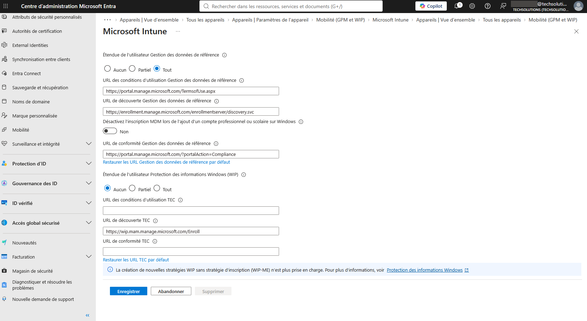
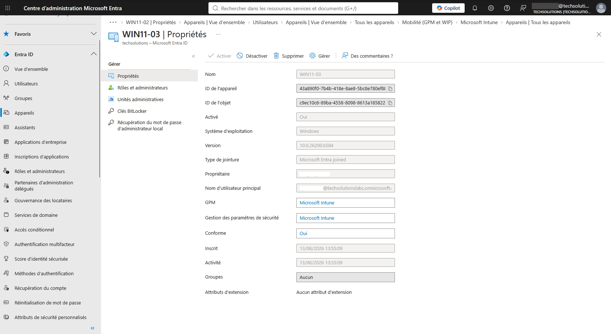

# Enroll Windows Device in Microsoft Intune

## Objective

Enroll the Windows device in Microsoft Intune and verify that it is managed by the organization.

## Steps

1. Sign in to the Windows device using the organizational account.
2. Open **Settings**.
3. Navigate to **Accounts → Access work or school**.
4. Verify the organizational account connected to Microsoft Entra ID.
5. Open the Microsoft Intune admin center.
6. Navigate to **Devices → All devices**.
7. Search for the Windows device.
8. Open the device properties.
9. Verify the device management information and last check-in status.

## Evidence

### Intune Devices

### Intune Device Properties

## Verification

* Successfully accessed the Windows device using the organizational account.
* Verified the organizational connection.
* Verified the Windows device in Microsoft Intune.
* Reviewed the device properties.
* Confirmed the device management status.

## Result

The Windows device was successfully enrolled and is visible in Microsoft Intune for centralized endpoint management.